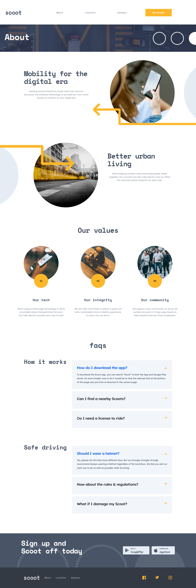

# Frontend Mentor - Scoot website solution

This is a solution to the [Scoot website challenge on Frontend Mentor](https://www.frontendmentor.io/challenges/scoot-multipage-website-N76alNPRJ). Frontend Mentor challenges help you improve your coding skills by building realistic projects.

## Table of contents

- [Overview](#overview)
  - [The challenge](#the-challenge)
  - [Screenshot](#screenshot)
  - [Links](#links)
- [My process](#my-process)
  - [Built with](#built-with)
  - [What I learned](#what-i-learned)
  - [Continued development](#continued-development)
  - [Useful resources](#useful-resources)
- [Author](#author)
- [Acknowledgments](#acknowledgments)

## Overview

### The challenge

Users should be able to:

- View the optimal layout for each page depending on their device's screen size
- See hover states for all interactive elements throughout the site

### Screenshot





### Links

- Live Site URL: [Scoot-multi-page web site](https://scoot-multi-page.netlify.app)

## My process

### Built with

- Semantic HTML5 markup
- SCSS custom properties
- Flexbox
- CSS Grid
- Mobile-first workflow
- [React](https://reactjs.org/) - JS library
- [Parcel.js](https://parceljs.org/) - sass bundler

### What I learned

for the accordion , each accordion will have an aria-expanded set to true or false. This has to be controlled used using javascript. Here is the js snippet to achieve that:

```javascript
 var x = document.getElementById("p2").getAttribute("aria-expanded"); 
  if (x == "true") 
  {
  x = "false"
  } else {
  x = "true"
  }
  document.getElementById("p2").setAttribute("aria-expanded", x);
```

- read more from the following article [How to toggle aria-expanded](http://www.davidmacd.com/blog/toggle-aria-expanded-javascript.html)

- Accordion example [accordion example](https://www.w3.org/TR/wai-aria-practices-1.1/examples/accordion/accordion.html)

- Bootstrap accordion inspiration [bootstrap accordion](https://getbootstrap.com/docs/5.0/components/accordion/)

### Continued development

- refactoring the components and css to be reusable

### Useful resources

- [accessibility](https://a11y-101.com/development/icons-and-links) - making anchor list accessible when there is a decorative element. Use a span that is visually hidden but can be read by screen readers.

## Author

- Website - [Chamu Mutezva](https://github.com/ChamuMutezva)
- Frontend Mentor - [@ChamuMutezva](https://www.frontendmentor.io/profile/ChamuMutezva)
- Twitter - [@ChamuMutezva](https://twitter.com/ChamuMutezva)

## Acknowledgments

- Frontend Mentor community leaders for providing a platform to engage with fellow learners and mentors. This makes the learning exciting.
